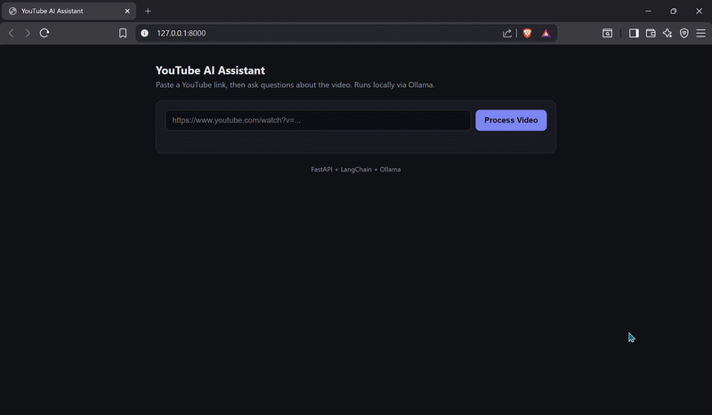

# YouTube AI Assistant

Ask questions about any YouTube video's content. Paste a link, and the app pulls the transcript, indexes it, and answers questions about it in a chat interface — all running locally via [Ollama](https://ollama.com), no external API keys required.


<!-- Add a screenshot or GIF of the app in use here, e.g.: -->
<!--  -->

## How it works

1. **Transcript extraction** — pulls the transcript for a given YouTube URL via `youtube-transcript-api`.
2. **Chunking & embedding** — splits the transcript into overlapping chunks and embeds them locally with Ollama (`nomic-embed-text`).
3. **Vector search** — stores embeddings in a FAISS index for fast similarity search.
4. **Conversational QA** — retrieves relevant chunks and answers questions using a local LLM (`llama3`) via LangChain, with per-session chat memory.
5. **Frontend** — a single-page chat UI served directly by FastAPI, no separate frontend build.

```
YouTube URL → transcript → chunk + embed → FAISS index → retrieve + LLM → answer
```

Each processed video gets its own session (`session_id`), so multiple videos can be processed and queried independently without clobbering each other's state.

## Setup

**Prerequisites:** Python 3.12, [Ollama](https://ollama.com) installed and running.

```bash
# Pull the models used by the app
ollama pull llama3
ollama pull nomic-embed-text

# Set up the environment
python3.12 -m venv venv
source venv/bin/activate
pip install -r requirements.txt

# Run it
uvicorn src.main:app --reload
```

Open `http://localhost:8000` in your browser.

## Configuration

Copy `.env.example` to `.env` if you need to point at a non-default Ollama host:

```
OLLAMA_BASE_URL=http://localhost:11434
```

## API

| Method | Endpoint   | Body                                   | Description                                |
|--------|-----------|-----------------------------------------|---------------------------------------------|
| POST   | `/process` | `{"url": "<youtube_url>"}`             | Fetches transcript, builds index, returns `session_id` |
| POST   | `/ask`     | `{"session_id": "...", "question": "..."}` | Answers a question about that video's content |

## Testing

```bash
pip install -r requirements-dev.txt
pytest -v
```

Tests mock out the transcript/embedding/LLM calls, so they run instantly and don't require Ollama or network access — they cover request validation, session handling, and error responses.

## Project structure

```
.
├── src/
│   ├── main.py              # FastAPI app, routes, session management
│   └── core/
│       ├── transcript.py    # YouTube transcript fetching
│       ├── vectorstore.py   # Chunking + embedding + FAISS
│       └── qa_chain.py      # Conversational retrieval chain
├── static/
│   └── index.html           # Frontend chat UI
├── tests/
│   ├── test_main.py
│   └── test_transcript.py
├── requirements.txt
├── requirements-dev.txt
└── pytest.ini
```

## Known limitations / possible next steps

- Sessions live in memory and are lost on server restart — fine for local/demo use, would need Redis or a DB for persistence in production.
- No support yet for videos without captions in the target language.
- Could add streaming responses instead of waiting for the full answer.
- Could containerize with Docker for one-command setup.

## License

MIT — see [LICENSE](LICENSE).